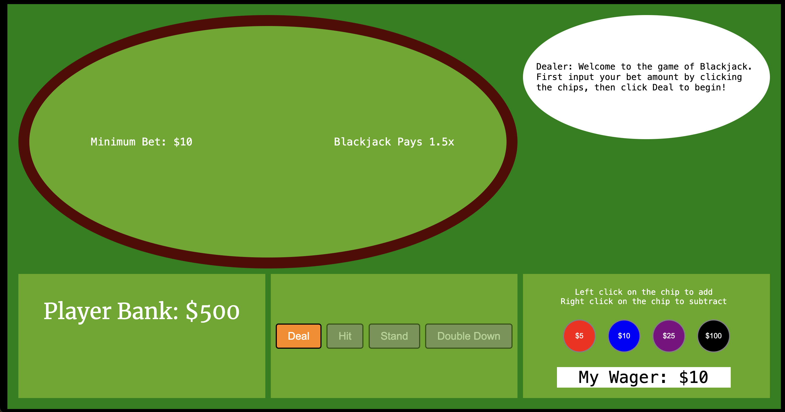
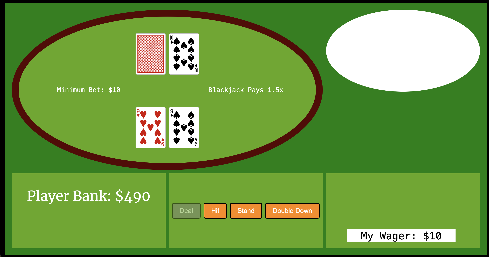
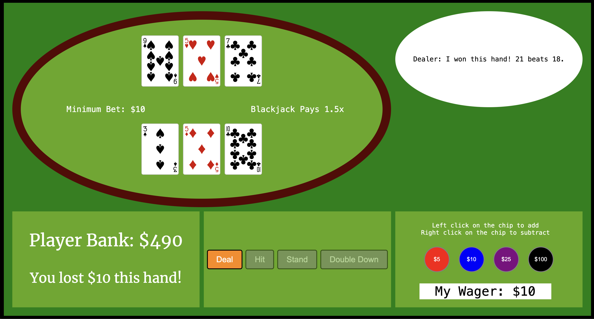

# Blackjack

  Blackjack is the most widely played casino card game in the world. Simply put, Blackjack is a game where the player is trying to beat the dealer by getting as close to 21 without going over (more info on how to play Blackjack below!). 
  #### Some Fun Facts
  * First references of the game date all the way back to 1601! 
  * Most people would say Blackjack popularity took off in the US during WWI. 
  * On average a single casino blacjack table profits $1,000 in one day...

  ## Screenshots
  
  
  

  ## Technologies Used
  * Javascript
  * HTML
  * CSS
  * CardStarter CSS Library

  ## Getting Started
  Have fun playing my game of [Blackjack](https://chadbanghart.github.io/blackjack/)
  [click here](planning/) to see my project planning

  #### How to play Blackjack
  For a step-by-step detail of how to play Blackjack, you can [click here!](https://www.blackjackapprenticeship.com/how-to-play-blackjack/)
  
  ##### Table Rules
  * This table pays out a blackjack at 3/2 odds.
  * The minimum bet per hand is $10.

  ##### Dealer Rules 
  * The dealer must hit their hand until they have reached 17 or busted. 

  ## Next Steps
  **Icebox Items**
  * House Suggestions
  * Sound Effects
  * Implement delay to cards being dealt
  * Show chips in the pot stacking up based on current value of the pot
  * make dealer messages appear as if they are being typed