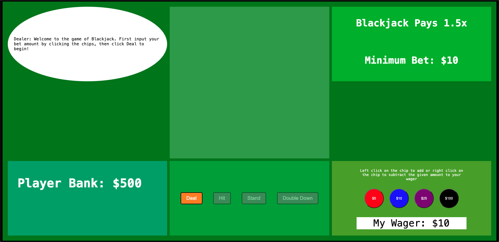
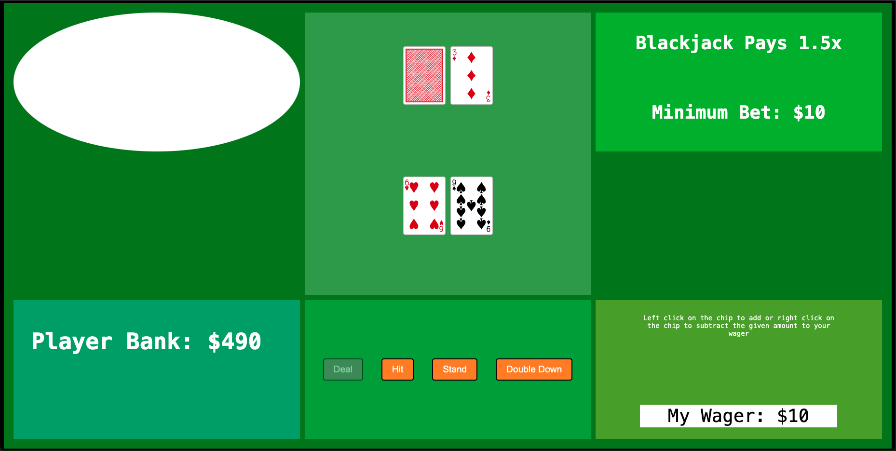
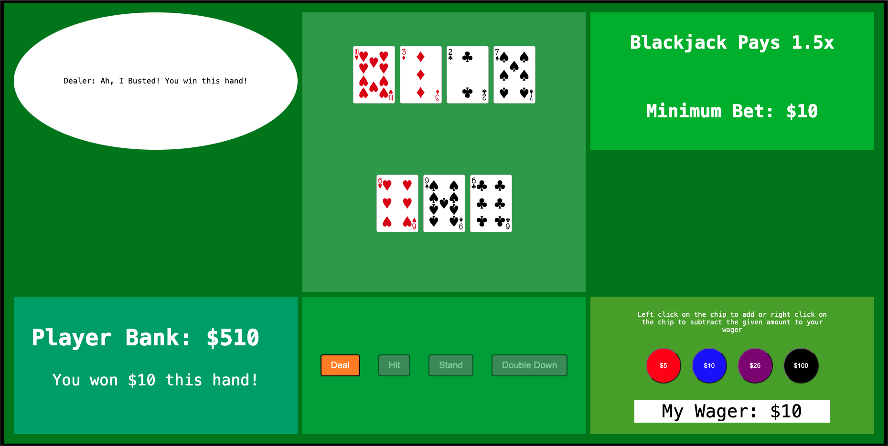
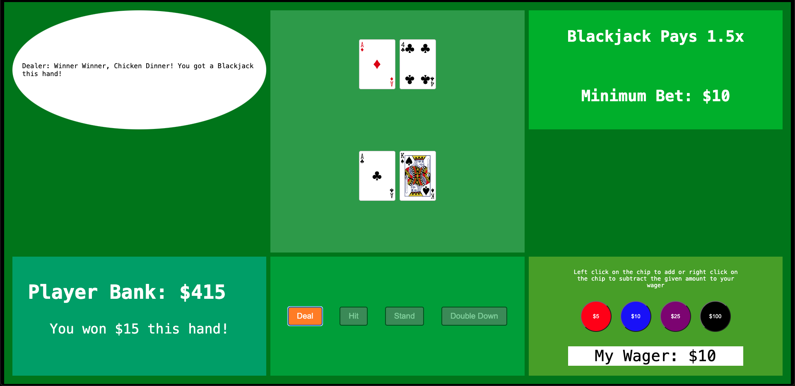

#Blackjack

  ####Game Introduction
  Blackjack is the most widely played casino card game in the world. First references of the game date all the way back to 1601!

  #####Table Rules
  *This table pays out a blackjack at 3/2 odds. If a player gets a blackjack(21) on the draw, their bet gets paid out at 1.5x their bet.
  *The minimum bet per hand is $10.

  ##Screenshots
  
  
  
  

  ##Technologies Used
  *Javascript
  *HTML
  *CSS

  ##Getting Started
  Have fun playing my game of [Blackjack](https://chadbanghart.github.io/blackjack/)

  ####How to play Blackjack
  For a step-by-step detail of how to play Blackjack, you can [click here!](https://www.blackjackapprenticeship.com/how-to-play-blackjack/)
  Otherwise, here are my breif rules for the game!
  Blackjack has a deck of 52 cards. In this deck there are 4 suits - hearts, diamonds, clubs, and spades. 
  Each suit has a card ranging from 2-10 and then face cards of jack, queen, king, and ace.
  Each card number is the value that card holds, the face cards - jack, queen, and king all equal 10, while the ace can equal 1 or 11.
  In the game of blackjack there are two players. the player and the dealer.
  The objective is to beat the dealer. In order to beat the dealer the player must either score higher than
  the dealer or the dealer must bust. The player plays their turn first. the players goal is for the sum of 
  their cards to get as close to 21 with out exceeding 21.
  If the players total card values exceed 21, the player loses (busts).
  To start a hand, the player must wager how much money they want to bet on the hand. Once the bet is placed, the hand is dealt.
  Both the player and the dealer are dealt 2 cards, the dealer gets one of their cards face down.
  the player now has the choice of either being dealt another card(hit) or stay with their hand as is(stand).
  The player is allowed to hit until they decide to stand or until they bust.
  If the player busts, the hand is over and they must bet again to play another hand.

  #####Dealer rules 
  Once the player has completed their turn, it is now the dealers turn. The dealer must hit their hand until they have reached 17 or busted. 

  #####Other Plays
  **Double Down** - the player has the option to do whats called a double down. A player can only double down when they have two cards in their hand. 
  If a play doubles down, they double their bet, and then get hit one card. If they do not bust, then it is the computers turn. If a player wins on a 
  double down they win 2x their initial bet and vice versa for a lose on a double down.

  ##Next Steps
  **Icebox Items**
  *House Suggestions
  *Sound Effects
  *Implement delay to cards being dealt
  *Show chips in the pot stacking up based on current value of the pot
  *make dealer messages appear as if they are being typed